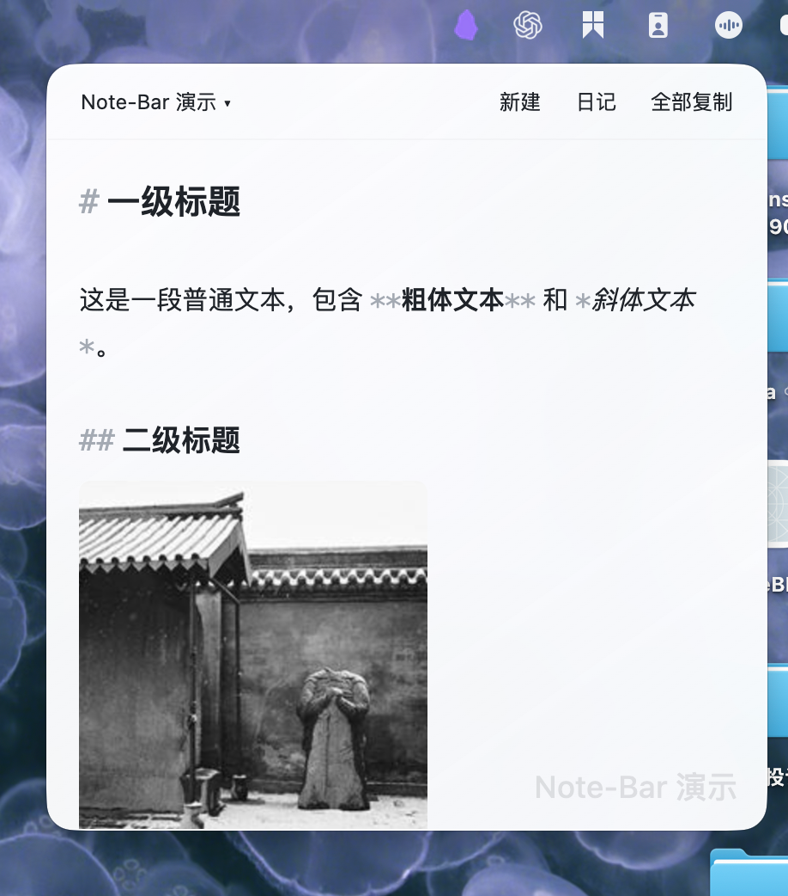

# Note-Bar · 菜单栏便签

在 macOS 菜单栏直接编辑 Obsidian 笔记。主窗口可以留在后台，切换应用或桌面时面板保持打开，再次点击菜单栏图标保存并收起。

## 演示



## 功能

- **Markdown 编辑**：淡化语法符号，支持列表层级、缩进、回车续行与撤销。
- **笔记操作**：按文件夹选择或搜索笔记，跟随 Obsidian 规则新建笔记、打开今日日记，一键复制原始 Markdown。
- **图片**：粘贴后按 Obsidian 附件设置保存，直接预览、拖动缩放，保留原图。
- **外观**：跟随 Obsidian 浅色／深色主题，支持 macOS 磨砂背景。

## 安装

当前已公开源码，尚未发布安装包或上架社区目录。后续安装包见 [Releases](https://github.com/hzgfly-ai/Note-Bar/releases)。

从源码构建（Node.js 24）：

```sh
npm ci
npm run build
```

将 `main.js`、`manifest.json`、`styles.css` 放入 `<你的仓库>/.obsidian/plugins/note-bar/`，重新加载 Obsidian 并启用插件，在插件设置中选择初始笔记。

## 使用须知

- 需要 Obsidian **1.13.0 或以上**保持运行；当前以 macOS 为验收目标，不支持移动端。
- 日记功能需启用核心「日记」插件；单张粘贴图片上限 **32 MB**。
- 部分功能依赖内部接口，Obsidian 升级后需检查兼容性。磨砂背景不等同于原生 Liquid Glass。
- 笔记与图片保存在本地仓库，不含遥测。网络图片仅在点击「加载网络图片」后访问其链接所指向的服务器。

## 许可与致谢

由 [hzgfly-ai](https://github.com/hzgfly-ai) 维护，基于 **Pedro Reis** 的 [Pebble](https://github.com/pedrojreis/Pebble)，保留原项目历史与版权声明。

采用 [MIT 许可](LICENSE)，打包依赖见 [第三方许可](THIRD-PARTY-NOTICES.md)，后续计划见 [ROADMAP](ROADMAP.md)。发布安装包时需携带这两份许可文件。
